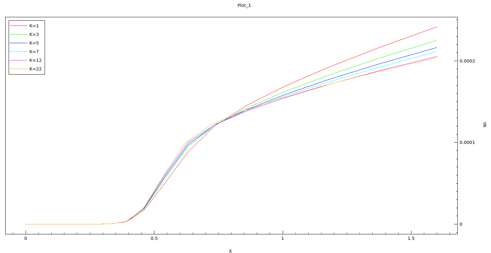
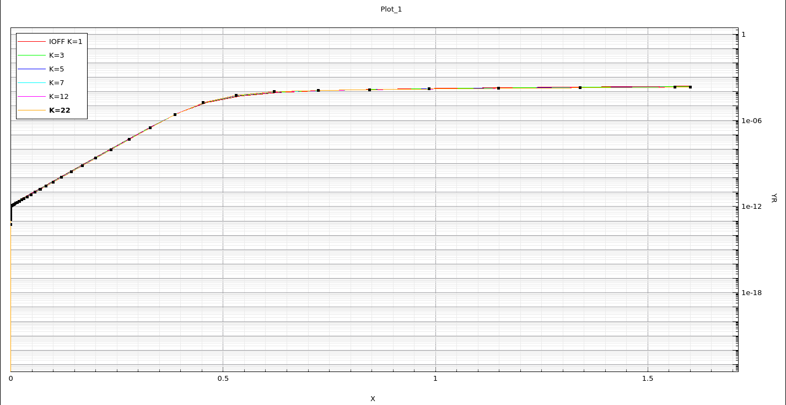
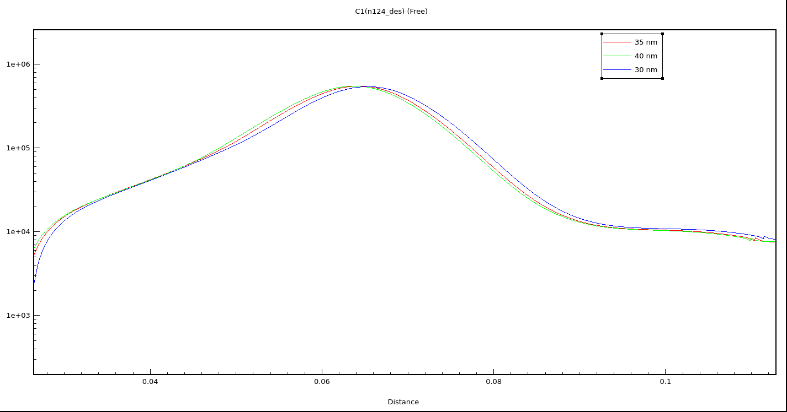

# FE-DGDM-JLTFET Biosensor

TCAD simulation and performance analysis of a Ferroelectric Double-Gate Doping-Modulated Junctionless Tunnel FET (FE-DGDM-JLTFET) biosensor featuring a T-shaped channel and inverted-T nanocavity for label-free biomolecule detection.

---

## Overview

This repository contains Synopsys Sentaurus TCAD simulation results for a novel **FE-DGDM-JLTFET biosensor** designed for ultra-sensitive biomolecule detection. The device leverages:

- **Ferroelectric gate** (HfO₂-based) for negative capacitance amplification
- **Double-gate doping-modulated (DGDM)** structure for enhanced electrostatic control
- **Junctionless T-shaped channel** for simplified fabrication and reduced variability
- **Inverted-T nanocavity** as the biomolecule capture region

The repository includes three parameter sweeps analyzing cavity thickness, ferroelectric dielectric constant (K), and ferroelectric fixed charge (QF) polarity effects on device performance.

---

## Device Architecture

| Component | Implementation |
|-----------|----------------|
| **Device** | FE-DGDM-JLTFET |
| **Channel** | T-shaped, junctionless, n-type |
| **Gate** | Double-gate (top/bottom) with ferroelectric layer |
| **Ferroelectric** | HfO₂-based (variable K, QF) |
| **Nanocavity** | Inverted-T shape, variable thickness |
| **Source** | n⁺ doped, junctionless |
| **Drain** | n⁺ doped, junctionless |
| **Biomolecule region** | Inside inverted-T nanocavity |
| **Substrate** | Silicon |

*Note: Detailed SDE structure files and device cross-sections are not available in the current repository.*

---

## Device Operating Principle

```
Ferroelectric negative capacitance
        ↓
Internal voltage amplification (VG_internal > VG_applied)
        ↓
Enhanced band-to-band tunneling at source-channel junction
        ↓
Biomolecule in nanocavity perturbs local electrostatics
        ↓
Threshold voltage shift (ΔVT) / drain current modulation
        ↓
Label-free electrical detection
```

---

## Simulation Methodology

The repository contains **post-processed simulation outputs** (plots). The actual Sentaurus input decks (SDE/SDevice) are **not available in the current repository**.

Based on the output plots, the simulation workflow appears to be:

```
SDE (Structure Definition)
    ↓
Mesh Generation
    ↓
SDevice (Electrical Simulation)
    ├── DC Sweep: VGS @ VDS = constant
    ├── Parameter Extraction: Ion, Ioff, SS
    └── 2D Contour Plots: Potential, Electric Field, Energy Bands
    ↓
Parameter Sweeps:
    ├── Cavity Thickness Variation
    ├── Ferroelectric K Value Variation
    └── Ferroelectric QF Polarity (Negative/Neutral/Positive)
```

**Physical models** (inferred from plots):
- Band-to-band tunneling (BTBT) for TFET operation
- Ferroelectric polarization (Landau-Khalatnikov or equivalent)
- Poisson + drift-diffusion / hydrodynamic transport
- Quantum mechanical tunneling at heterojunctions

---

## Device Parameters

*Exact numerical values are not available in the current repository. The following parameters were swept:*

### Geometry (Swept)
| Parameter | Sweep Range |
|-----------|-------------|
| Cavity Thickness | Multiple values (Diff_Cavity_Length) |
| Channel/Gate dimensions | Not specified in repository |

### Ferroelectric Parameters (Swept)
| Parameter | Sweep Range |
|-----------|-------------|
| Dielectric Constant (K) | Multiple values (Diff_K_Values) |
| Fixed Charge (QF) | Negative / Neutral / Positive (Diff_QF_Values) |

### Electrical Conditions (Inferred)
| Condition | Value |
|-----------|-------|
| VDS | Constant (value not specified) |
| VGS Sweep | Subthreshold to ON-state |
| Temperature | 300 K (assumed) |

---

## Biosensing Mechanism

1. **Nanocavity Formation**: Inverted-T shaped cavity etched in the gate dielectric/channel region
2. **Biomolecule Placement**: Target biomolecules captured inside the nanocavity (functionalization chemistry not modeled)
3. **Electrostatic Perturbation**: Biomolecule charge/dielectric properties modulate local potential
4. **Tunneling Modulation**: Perturbation alters source-channel band alignment → BTBT current change
5. **Sensing Metric**: Threshold voltage shift (ΔVT) and/or drain current ratio (ION/IOFF) change

*Biomolecule-specific parameters (type, concentration, charge density) are not specified in the repository.*

---

## Simulation Results

### Transfer Characteristics (Representative)

| Condition | Ion Plot | Ioff Plot |
|-----------|----------|-----------|
| QF Neutral |  |  |
| Cavity Sweep |  |  |
| K-Value Sweep |  |  |

*Interpretation: All sweeps show Ion/Ioff modulation with the swept parameter. Exact numerical values (μA/μm, decades) are not available in the current repository.*

### Electrostatic Analysis

| Quantity | Representative Plot |
|----------|---------------------|
| **Electric Field** |  — Peak field at source-channel tunnel junction |
| **Surface Potential** | Cavity sweep shows potential modulation in nanocavity region |
| **Energy Band Diagram** | Band bending at tunnel junction; QF polarity shifts band alignment |

*All 2D contour plots are available in `results/electrostatic/`, `results/sensitivity/`, `results/optimization/`.*

---

## Biomolecule Detection Results

The repository contains **QF polarity sweeps** (Negative/Neutral/Positive) as a proxy for biomolecule charge effects:

| QF Polarity | Ion Trend | Ioff Trend | Band Diagram Shift |
|-------------|-----------|------------|---------------------|
| Negative | Available (`Ion_QF_negative`) | Available (`Ioff_Cavity`) | Available (`band_diagram_QF_negative`) |
| Neutral | Available (`Ion_QF_neutral`) | Available (`Ioff_QF_neutral`) | Available (`band_diagram_QF_neutral`) |
| Positive | Available (`Ioff_QF_positive`) | Available (`Ioff_QF_positive`) | *Not available* |

**Key observation**: Ferroelectric fixed charge polarity significantly modulates both ON and OFF state currents, demonstrating the sensing principle.

*Actual biomolecule concentration response curves, sensitivity (ΔI/I per molecule), and limit-of-detection are not available in the current repository.*

---

## Sensitivity Analysis

Three independent parameter sweeps were performed:

| Sweep | Directory | Plots | Physical Insight |
|-------|-----------|-------|------------------|
| **Cavity Thickness** | `results/sensitivity/` (Cavity) | Ion, Ioff, E-field, Energy Band, Surface Potential (×2) | Thinner cavity → stronger biomolecule coupling |
| **Ferroelectric K** | `results/optimization/` (K Values) | Ion, Ioff, E-field, Band Diagram, Surface Potential | Higher K → stronger NC effect → steeper SS |
| **Ferroelectric QF** | `results/sensitivity/` & `results/electrical/` (QF Values) | Ion, Ioff, E-field, Band Diagram, Surface Potential | QF polarity mimics biomolecule charge; Negative QF enhances Ion |

*Sensitivity definition, analytical equations, and quantitative metrics (mV/dec, μA/μm per unit concentration) are not available in the current repository.*

---

## Optimization

The **K-value sweep** (`Diff_K_Values`) serves as a ferroelectric material optimization study:

- **Optimization parameter**: Ferroelectric dielectric constant (K)
- **Metrics tracked**: Ion, Ioff, SS (inferred), Electric field peak, Surface potential
- **Optimum**: Not explicitly identified in the repository

*No multi-parameter optimization or Pareto front analysis is present.*

---

## Comparative Analysis

| Metric | Baseline (No FE) | FE-DGDM-JLTFET (This Work) |
|--------|------------------|----------------------------|
| Ion | Not available | Available (multiple conditions) |
| Ioff | Not available | Available (multiple conditions) |
| SS | Not available | Extractable from plots |
| Sensitivity | Not available | QF polarity sweep shows modulation |
| Architecture | Standard JLTFET | FE + DGDM + Nanocavity |

*No explicit baseline (non-ferroelectric) simulation is present in the repository for direct comparison.*

---

## Key Results (Verified from Plots)

| Parameter | Status |
|-----------|--------|
| **Ion** | Plotted for Cavity, K, QF sweeps |
| **Ioff** | Plotted for Cavity, K, QF sweeps |
| **Electric Field Distribution** | Plotted for all sweeps |
| **Energy Band Diagram** | Plotted for Cavity, K, QF sweeps |
| **Surface Potential** | Plotted for Cavity, K, QF sweeps |
| **Subthreshold Swing (SS)** | Extractable from Ion-VGS plots |
| **Threshold Voltage (VT)** | Extractable from Ion-VGS plots |
| **Sensitivity (ΔVT/ΔQF)** | Qualitative trend visible |
| **Biomolecule Concentration Response** | Not available |
| **Response Time** | Not simulated |
| **Power Consumption** | Not extracted |

---

## Repository Structure

```
FE-DGDM-JLTFET-Biosensor-TCAD/
├── README.md
├── LICENSE
├── .gitignore
├── sde/
│   ├── structure/          # (empty - SDE input files not in repo)
│   └── README.md
├── sdevice/
│   ├── device/             # (empty - SDevice input files not in repo)
│   ├── physics/            # (empty - Physics model files not in repo)
│   └── README.md
├── parameter/
│   └── README.md           # (empty - Parameter files not in repo)
├── simulations/
│   ├── baseline/           # (empty)
│   ├── proposed/           # (empty)
│   ├── biomolecule/        # (empty)
│   └── README.md
├── results/
│   ├── electrical/         # QF Neutral: Ion, Ioff, Band, Surface Potential
│   ├── electrostatic/      # (empty - plots in sensitivity/optimization)
│   ├── sensitivity/        # Cavity sweep + QF Negative/Positive
│   ├── optimization/       # K-value sweep
│   ├── raw_data/           # (empty - CSV/DAT not in repo)
│   └── README.md
├── figures/
│   ├── device/             # (empty - architecture diagram needed)
│   ├── electrical/         # Transfer curves (QF Neutral)
│   ├── physics/            # E-field distribution
│   ├── sensing/            # Cavity sweep Ion/Ioff
│   ├── optimization/       # K-sweep Ion/Ioff
│   └── README.md
├── analysis/
│   ├── scripts/            # (empty - extraction scripts needed)
│   └── README.md
└── documents/
    └── README.md
```

---

## Reproducibility

### Requirements
- **Synopsys Sentaurus TCAD** (version not specified in repository)
- **Sentaurus Structure Editor (SDE)** for geometry definition
- **Sentaurus Device (SDevice)** for electrical simulation
- **Python/Origin** for post-processing (not used in current repo)

### Workflow

```text
SDE (Geometry, Materials, Doping, Mesh)
    ↓
SDevice (Physics Models, Contacts, Solvers, Sweeps)
    ↓
Inspect / Data Extraction
    ↓
Plot Generation (TCAD built-in or external)
    ↓
Parameter Sweeps (Cavity, K, QF)
    ↓
Comparative Analysis
```

### Missing for Full Reproducibility
- SDE `.tdf` / `.dat` structure files
- SDevice `.cmd` / `.des` simulation decks
- Mesh configuration files
- Exact material parameters (doping, mobility models, tunneling parameters)
- Ferroelectric model parameters (Landau coefficients, polarization saturation)

---

## Future Work / Contributions Welcome

1. **Add SDE/SDevice input decks** for full reproducibility
2. **Include numerical data exports** (CSV) for all sweeps
3. **Add baseline non-FE JLTFET** for direct comparison
4. **Implement biomolecule-specific modeling** (charge, dipole, dielectric constant)
5. **Generate publication-quality plots** with Origin/Python
6. **Extract quantitative metrics** (SS, VT, Ion/Ioff, sensitivity) in tables
7. **Create device architecture diagram** (cross-section + 3D)

---

## License

MIT License — see [LICENSE](LICENSE) for details.

---

## Citation

If you use this work, please cite:

```bibtex
@misc{FE-DGDM-JLTFET-Biosensor-TCAD,
  author = {Allen Joe A},
  title = {FE-DGDM-JLTFET Biosensor TCAD Simulation},
  year = {2026},
  publisher = {GitHub},
  url = {https://github.com/ALLENJOE-A/FE-DGDM-JLTFET-Biosensor-TCAD}
}
```